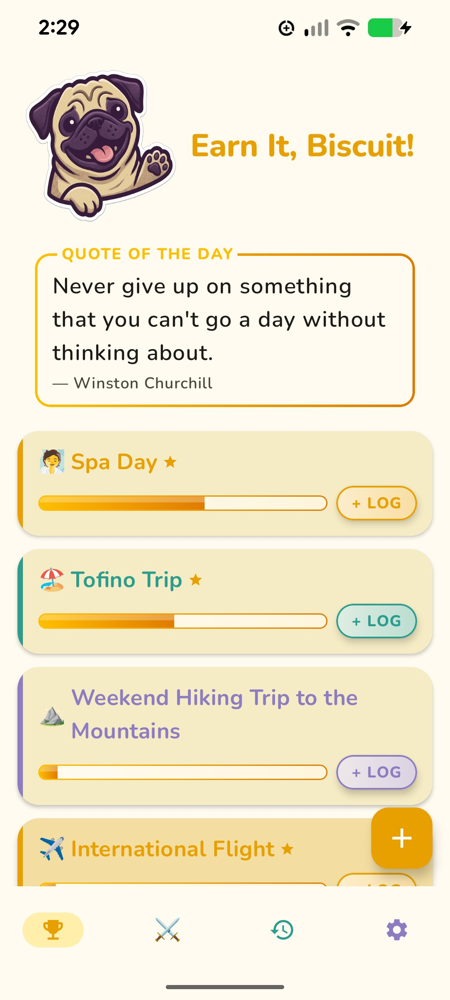
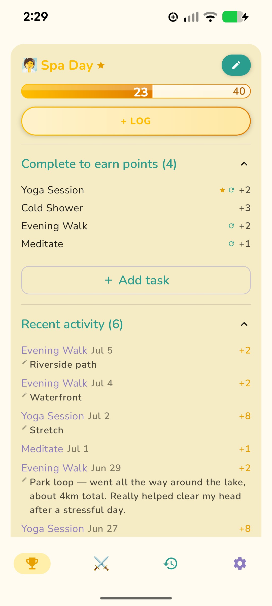
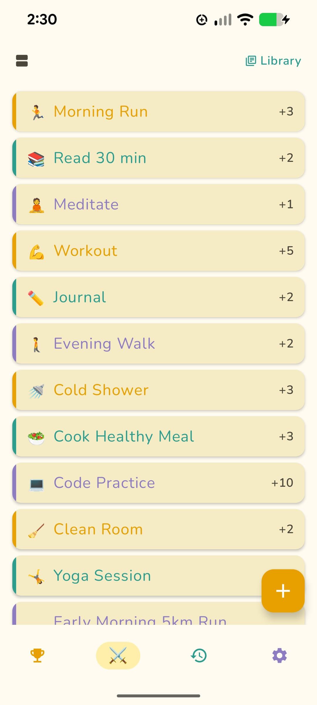
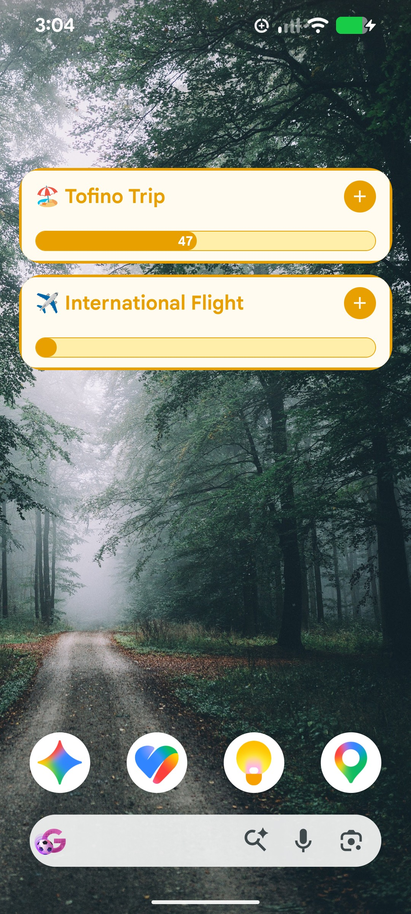
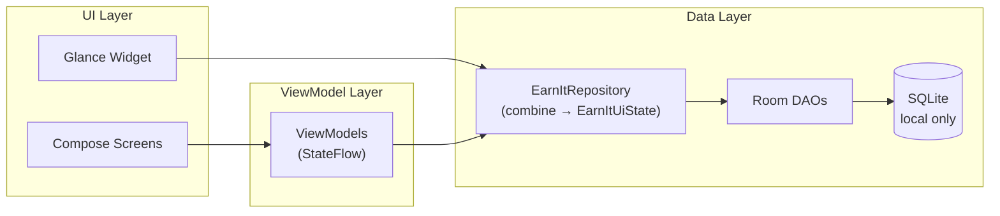

# EarnIt

A local-only productivity app for Android. 

<!-- Badges: add once CI and Play Store listing are live -->
<!--  -->
<!--  -->

---

## The idea

You've got your wants and a list of tasks you keep putting off. EarnIt connects the two. Pick a reward, set a point cost, link the tasks that should fund it, then get to work. Complete the tasks, log them, watch the balance grow. A mandatory task check means no shortcuts — you actually did the work before you claim.

---

  
  
  
  

---

## What it does

- **Earn points by completing tasks.** Each reward has its own point balance — logging a task credits that reward only, with no global pool.
- **Flexible task scoring.** Assign points manually, or let the app calculate them from time, difficulty, and preparation sliders using a weighted formula.
- **Per-reward task configuration.** Each task linked to a reward can be marked mandatory or optional, and repeatable or single-log — giving you precise control over what it takes to earn each reward.
- **Mandatory gatekeeper tasks** must be completed before a reward can be claimed, so you can't shortcut your way to the prize.
- **Claim with a tap.** Every claim archives to History with a full log of the tasks and points that funded it. Claimed rewards can be reactivated to run the cycle again.
- **Home screen widget** for at-a-glance progress and one-tap task logging without opening the app.
- **Task organisation** — drag to reorder, or switch to a group view with collapsible sections.
- **Task Library** with curated templates (Healthy Living, Social, Clean Home) to get started fast.
- **Export and import** your full data as JSON — or rely on Android's automatic daily Google account backup.
- **Themes** Three colour themes (Warm Gold, Ocean Blue, Forest), full light/dark mode, mascots and daily quotes.

---

## Tech stack

| Layer | Technology |
|---|---|
| Language | Kotlin |
| UI | Jetpack Compose + Material 3 |
| Architecture | MVVM — ViewModel + StateFlow |
| Widget | Jetpack Glance |
| Storage | Room (SQLite) — local only, no cloud sync |
| DI | Hilt |
| Navigation | Navigation Compose |
| Settings | DataStore Preferences |
| Serialisation | Moshi (export/import) |
| Min SDK | API 31 (Android 12) |

---

## Architecture

MVVM throughout. `EarnItRepository` is the single source of truth, combining multiple Room Flows into a unified `EarnItUiState`. ViewModels consume that state via `StateFlow` and expose it to Compose screens. The Glance widget reads the repository directly — independent of the main activity lifecycle. Hilt wires every layer together.

---

## Documentation

| File | Purpose |
|---|---|
| [`docs/EARNIT_SPEC.md`](docs/EARNIT_SPEC.md) | Full product spec — feature definitions, data model, screen map |
| [`docs/TESTING.md`](docs/TESTING.md) | Test strategy, coverage tables, known gaps and deferrals |
| [`docs/MANUAL_TEST_PLAN.md`](docs/MANUAL_TEST_PLAN.md) | Manual-only test journeys with rationale, cadence, and steps |
| [`docs/DEV_PLAYBOOK.md`](docs/DEV_PLAYBOOK.md) | Ship checklist, release process, tooling upgrade reference |
| [`docs/CLEANUP_RULES.md`](docs/CLEANUP_RULES.md) | Post-work cleanup checklist and log retention rule |
| [`docs/CLEANUP_LOG.md`](docs/CLEANUP_LOG.md) | The 3 most recent cleanup passes and what was found |
| [`docs/QA_AUDIT_RULES.md`](docs/QA_AUDIT_RULES.md) | Periodic whole-suite QA audit checklist |
| [`docs/CLOSED_TESTING_GUIDE.md`](docs/CLOSED_TESTING_GUIDE.md) | Plain-language testing guide for Play closed testing recruits |

---

## AI-assisted development workflow

Every feature was defined in `EARNIT_SPEC.md` before any code was written, and the AI implemented from that. Claude (via Claude Code) generated first-draft implementations, maintained documentation, ran cleanup passes, and set up tooling. All product decisions, UX direction, and architectural choices were made by the human product owner. Every branch was reviewed and approved before merging.

Quality is maintained through a documented test strategy: 100+ unit tests and 40+ instrumented tests (including Compose UI tests) plus a manual test plan for flows that cross system boundaries. Structured cleanup passes are done after every feature. 

---

© 2026 SecondMonday Studios. All rights reserved.
